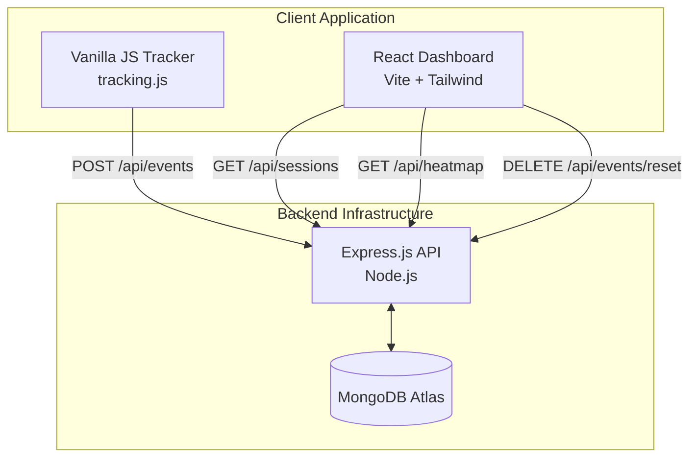

<div align="center">
  
  <h1 align="center">SessionPulse</h1>
  <p align="center">
    <strong>Lightweight User Analytics & Session Tracking Platform</strong>
  </p>
</div>

---

SessionPulse is a full-stack, lightweight user analytics dashboard designed to track real-time user behavior, persist unique sessions, and visualize click heatmaps. Built as a cleaner, faster alternative to heavy enterprise analytics tools.

## 🌟 Features

- **Real-Time Session Tracking**: Automatically groups interactions by session with auto-expiring persistent local storage.
- **Visual Click Heatmaps**: Canvas-based rendering engine that aggregates click coordinates into a cold-to-hot density map over a browser mockup.
- **User Journey Timelines**: Chronological recreation of a user's path across your site, detailing precise timestamps, page URLs, and X/Y coordinates.
- **Live Dashboard**: Auto-refreshing (5s) React SPA with real-time event counters, searchable sessions, and beautiful data visualizations.
- **Demo Mode**: Built-in 🧪 **Demo Controls** allow you to instantly reset the analytics database or simulate new sessions to test the tracker safely.
- **Production Ready**: Fully dockerized concepts, CI/CD ready environment configurations, and deployment templates for Vercel/Render.

---

## 🏗️ Architecture



### Folder Structure

```text
sessionpulse/
├── client/                 # React SPA Dashboard (Vite + TailwindCSS)
│   ├── src/
│   │   ├── components/     # UI Building Blocks (Sidebar, HeatmapCanvas, etc.)
│   │   ├── hooks/          # React hooks for API data fetching (SWR-like)
│   │   ├── pages/          # View Controllers (Sessions, Heatmap)
│   │   └── utils/          # Heatmap rendering engine & formatters
│   └── vercel.json         # Vercel Deployment Configuration
│
├── server/                 # Express.js REST API
│   ├── src/
│   │   ├── controllers/    # Route logic & DB queries
│   │   ├── models/         # Mongoose Schemas (Event)
│   │   └── routes/         # Express Routers
│
├── tracker/                # Vanilla JavaScript Tracking Snippet
│   ├── tracking.js         # The core tracking script
│   └── demo.html           # A dummy page to test tracking
│
└── render.yaml             # Render.com Deployment Configuration
```

---

## 🛠️ Tech Stack

**Frontend:**
- React 18
- Vite
- Tailwind CSS v3
- Vanilla HTML5 Canvas (for Heatmaps)

**Backend:**
- Node.js
- Express.js
- Mongoose (MongoDB ORM)

**Tracking:**
- Vanilla JavaScript (ES5 compatible for maximum browser support)
- Fetch API with `keepalive: true`

---

## 🚀 Setup Instructions

### Prerequisites
- Node.js v18+
- MongoDB instance (Atlas or local)

### 1. Environment Variables

**Backend (`server/.env`):**
```env
PORT=5000
MONGO_URI=mongodb+srv://<user>:<password>@cluster.mongodb.net/sessionpulse
NODE_ENV=development
```

**Frontend (`client/.env.local`):**
*(Only required for production. In development, Vite proxies to the backend automatically).*
```env
VITE_API_URL=https://your-backend-api.onrender.com/api
```

### 2. Running Locally

You'll need two terminals to run the application in development mode.

**Terminal 1 (Backend):**
```bash
cd server
npm install
npm run dev
# Server runs on http://localhost:5000
```

**Terminal 2 (Frontend):**
```bash
cd client
npm install
npm run dev
# Dashboard runs on http://localhost:3000
```

---

## 📡 Tracker Integration

To track your own website, include the `tracking.js` script in your HTML.

If your backend is hosted in production, you **must** configure the endpoint before loading the script:

```html
<script>
  // Point the tracker to your deployed Express backend
  window.SESSIONPULSE_ENDPOINT = 'https://your-backend-api.onrender.com/api/events';
</script>
<script src="path/to/tracking.js"></script>
```

---

## 🧪 Demo Instructions

1. Start both the backend and frontend servers locally.
2. Open `tracker/demo.html` in your browser.
3. Click around the page to generate events (page views and clicks).
4. Open the Dashboard at `http://localhost:3000`.
5. You will see your session appear automatically (the dashboard refreshes every 5 seconds).
6. **Testing Reset:** Expand the **🧪 Demo Controls** section on the left and click **Reset Analytics** to wipe the database and start fresh.

---

## 🌍 Deployment Guide

### Backend (Render)
This repository includes a `render.yaml` Blueprint.
1. Push this repository to GitHub.
2. In Render, create a new "Blueprint".
3. Connect your repository. Render will automatically provision the Node.js web service.
4. Set the `MONGO_URI` environment variable in the Render dashboard.

### Frontend (Vercel)
This repository includes a `vercel.json` file for SPA routing.
1. In Vercel, import the `client` directory as a new project.
2. The framework preset should automatically detect Vite.
3. Add the `VITE_API_URL` environment variable pointing to your deployed Render URL.
4. Deploy.

---

## 📖 API Documentation

| Method | Endpoint | Description |
|---|---|---|
| `POST` | `/api/events` | Ingests a new event (`page_view` or `click`). Requires `session_id`, `event_type`, `page_url`. Optional: `x`, `y`. |
| `GET` | `/api/sessions` | Returns a grouped list of all sessions, including total events and last activity timestamp. |
| `GET` | `/api/sessions/:id` | Returns the complete chronological event timeline for a specific session. |
| `GET` | `/api/heatmap?page=URL` | Returns an array of X/Y coordinates for all clicks on a specific URL. |
| `DELETE` | `/api/events/reset` | **Demo Only:** Deletes all events in the database. |

---

## 🧠 Assumptions & Trade-offs

1. **Session Persistence**: Sessions are tied to `localStorage` (`sp_session_id`). If a user switches browsers or uses incognito mode, they are treated as a new session. This trades absolute cross-device accuracy for extreme privacy and simplicity (no cookies, no fingerprinting).
2. **Heatmap Accuracy**: The heatmap maps clicks natively to a 1280x800 virtual viewport. If users click on heavily responsive or liquid layouts, the exact DOM element clicked might shift relative to X/Y coordinates on different screen sizes. A production tracker would likely record DOM selectors in addition to raw coordinates.
3. **Polling vs WebSockets**: The dashboard uses short polling (5s intervals) instead of WebSockets. For a lightweight analytics tool, the overhead of maintaining persistent WebSocket connections for dashboards isn't strictly necessary until traffic reaches significant scale.

---

## 🔮 Future Improvements

- **DOM Element Tracking**: Capture the CSS selector or text of the element clicked, not just X/Y coordinates.
- **Scroll Depth Tracking**: Trigger events when a user scrolls 25%, 50%, 75%, and 100% down the page.
- **Authentication**: Secure the dashboard and API behind JWT or OAuth.
- **Data Retention Policies**: Automatically archive or delete events older than 30 days to save database storage.
