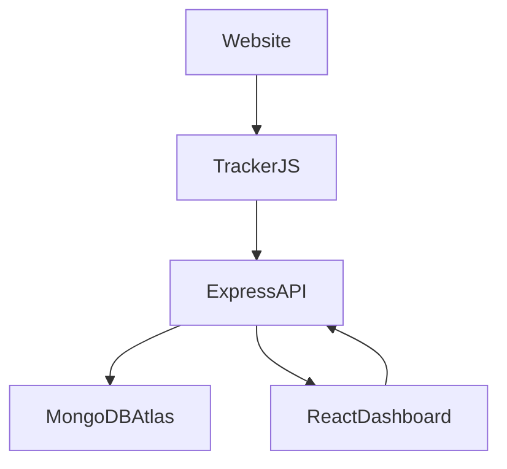

<div align="center">


# 🚀 SessionPulse

### Lightweight User Analytics & Session Tracking Platform

Track user sessions, visualize click heatmaps, and replay user journeys with a modern full-stack analytics dashboard.

[]()
[]()
[]()
[]()
[]()

</div>

---

# 🌐 Live Demo

### Dashboard

**https://session-pulse.vercel.app**

### Backend API

**https://sessionpulse-api.onrender.com**

### Tracker Demo

**https://session-pulse.vercel.app/tracker/demo.html**

---

# 📖 Overview

SessionPulse is a lightweight full-stack user analytics platform inspired by modern behavioral analytics tools like Hotjar and Microsoft Clarity.

It captures **page views**, **click events**, and **user sessions** through a standalone JavaScript tracking script, stores analytics data in **MongoDB Atlas**, and visualizes user behavior using an interactive **React dashboard** featuring session timelines and click heatmaps.

---

# ✨ Features

## 📊 Event Tracking

- ✅ Page View Tracking
- ✅ Click Tracking
- ✅ Session Persistence (localStorage)
- ✅ Timestamp Recording
- ✅ Click X/Y Coordinate Capture

## 📈 Analytics Dashboard

- ✅ Live Event Counter
- ✅ Auto Refresh (Every 5 Seconds)
- ✅ Session Search
- ✅ Copy Session ID
- ✅ User Journey Timeline
- ✅ Loading & Empty States

## 🔥 Heatmap Visualization

- ✅ Canvas-based Heatmap Rendering
- ✅ URL Based Filtering
- ✅ Density Visualization
- ✅ Browser Mockup Overlay

## 🧪 Demo Tools

- ✅ Reset Analytics
- ✅ Start New Session
- ✅ Live Tracker Demo

---

# 🏗️ Architecture



---

# 📁 Project Structure

```text
SessionPulse/

├── client/
│   ├── public/
│   │   └── tracker/
│   │       ├── demo.html
│   │       └── tracking.js
│   └── src/
│       ├── components/
│       ├── hooks/
│       ├── pages/
│       ├── services/
│       └── utils/
│
├── server/
│   ├── src/
│   │   ├── models/
│   │   ├── routes/
│   │   ├── middleware/
│   │   └── controllers/
│
└── README.md
```

---

# 🛠️ Tech Stack

### Frontend

- React 18
- Vite
- Tailwind CSS
- HTML5 Canvas

### Backend

- Node.js
- Express.js

### Database

- MongoDB Atlas
- Mongoose

### Tracking

- Vanilla JavaScript
- Fetch API
- localStorage

### Deployment

- Vercel
- Render
- MongoDB Atlas

---

# 🚀 Running Locally

## Clone Repository

```bash
git clone https://github.com/<your-username>/SessionPulse.git

cd SessionPulse
```

## Backend

```bash
cd server

npm install

npm run dev
```

Runs on:

```
http://localhost:5000
```

## Frontend

```bash
cd client

npm install

npm run dev
```

Runs on:

```
http://localhost:3000
```

---

# 🔧 Environment Variables

### Backend (`server/.env`)

```env
PORT=5000

MONGODB_URI=your_mongodb_connection_string

CLIENT_URL=http://localhost:3000

NODE_ENV=development
```

### Frontend (`client/.env`)

```env
VITE_API_URL=http://localhost:5000/api
```

---

# 📡 Tracker Integration

Add the tracking script to any webpage.

```html
<script>
window.SESSIONPULSE_ENDPOINT =
"https://sessionpulse-api.onrender.com/api/events";
</script>

<script src="tracking.js"></script>
```

Automatically tracks:

- page_view
- click
- session_id
- timestamp
- page_url
- x/y coordinates

---

# 📊 API Endpoints

| Method | Endpoint | Description |
|------------|-------------------------------------|---------------------------|
| POST | `/api/events` | Create new analytics event |
| GET | `/api/sessions` | Fetch all sessions |
| GET | `/api/sessions/:id` | Fetch session timeline |
| GET | `/api/heatmap?page=url` | Fetch click coordinates |
| DELETE | `/api/events/reset` | Reset demo analytics |

---

# 🧠 Design Decisions

### Session Storage

Uses `localStorage` instead of cookies to keep the tracker lightweight and privacy-friendly.

### Heatmap Rendering

Clicks are rendered using HTML5 Canvas with additive density rendering and color interpolation.

### Dashboard Updates

Uses lightweight polling every 5 seconds instead of WebSockets for simplicity and scalability.

---

# 🔮 Future Improvements

- Scroll Depth Analytics
- DOM Element Tracking
- Authentication
- Team Workspaces
- Export Analytics
- Session Replay
- Real-time WebSocket Updates
- Multi-project Support

---

### ⭐ SessionPulse

**Track • Analyze • Visualize**

Built with ❤️

</div>
